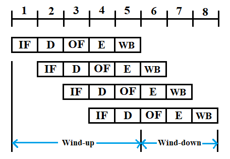
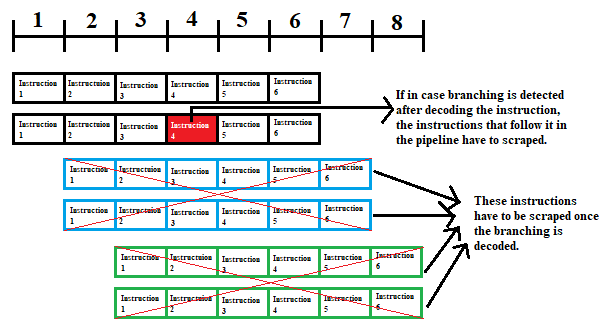
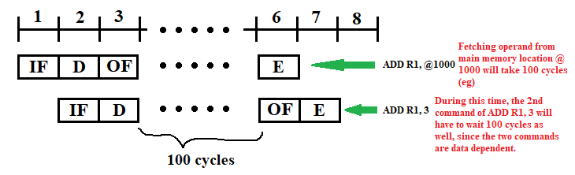

## Title: Introduction to Parallel Programming in OpenMP

**Link: <https://www.youtube.com/playlist?list=PLJ5C_6qdAvBFMAko9JTyDJDIt1W48Sxmg>**

---

### 1.1 Introduction to Parallel Programming:

#### 1.1.1 Serial Computing:
- Problem is broken into stream of instructions
- each of these instructions are executed sequentially one after the the other on a single processor (&/or core)
- One instruction executes at a time

#### 1.1.2 Parallel Computing:
- Problem is broken into parts that can be solved concurrently
- Each part is further broken down into a stream of instructions
- Instructions from each of these different parts executes simultaneously on different processors (&/or cores)

#### 1.1.3 Why need for parallel computing:
- Divide compute work and save time
- Large scale simulations and ML workloads require large amount of memory, too impractical for single computer. Hence, use multi-node parallel computer which divides problem into managable chunks
- Processors are not getting faster (Freq. has hit peak) due to heat dissipation and power consumption issues

<br>

### 1.2 Parallel Architectures & Programming Models:

| Memory Models | Parallel Architectures | Programming Models |
| --- | --- | --- |
| **Shared Memory** <br><br> (Popular framework - **OpenMP**) | A single **memory** unit is **shared by all processors** (i.e. all processors have access to this shared memory). Typically a common **BUS sits** between the memory and the processing units. An **Arbiter**[^1] figures out which CPU gets access to the memory.<br> Shared memory systems have a limit on number of processors/cores that can access the same memory via the BUS. Thus, here the BUS becomes the bottleneck. | This assumes that there is a huge **global address space** (in the memory) that is accessible/visible to all the tasks. It is known as **Shared Memory Programming Model**. |
| **Distributed Memory** <br><br> (Popular framework - **MPI**) | Every CPU has its **own memory unit**. Thus, a CPU and its own memory form a node. They need to be synced up when solving a divided problem. They talk to each other via a Network.<br> The problem of upper limit of number of CPUs/Cores is solved in that the number is bounded by the number of nodes. The bottleneck shifts to the network. | Here we have **Message Passing Programming Model**, where each task has its own address space (private). If one task wants to get data from another task, it has to explicitly do message passing over the network. Two important keywords associated with this type of programming model are **send** and **receive (recv)**. |
| **Hybrid** <br><br> (Popular framework combo - **OpenMP** + **MPI**) | In reality, the hybrid approach is generally favoured. It has several nodes, and each node has multiple CPUs. It could also be a CPU and a GPU. | A combination of message passing and shared memory is used. Typically you have different processes running on different nodes of the distributed memory architecture and within each node we use shared memory model for multiple cores. |

_<u>Note</u>: It is possible to have a shared memory architecture that works on top of message passing programming model and also to have a message passing architecture that works on top of shared memory programming model. <br> Take the case of message passing build on top shared memory architecture - a process has its own address space and other process cannot see this address space unless you do explicit message calls. <br> Similarly, you can do a shared memory programming with distributed memory architecture - The distributed memory will have an image of a global memory (snapshot of all distributed memories combined), but accessing data from a local process becomes the responsibility of the OS (since the memory sharing has to be implicit by default). The programmer does not need to worry about this explicitly, although data fetching rates will vary greatly._

_<u>Note</u>: GPUs also adhere to shared memory architecture and programming model. many GPUs at many nodes can be combined via message passing to get a even greater performance. Nvidia GPUs use CUDA framework (built on top of C & C++)._

<br>

### 1.3 Pipelining:

#### 1.3.1 Single Processor Architecture

- A simple single processor setup consists of the Processor itself, a memory unit, and the data path between them. Any of those could be the bottlenecks depending upon the algorithm to be implemented.
- Modern-day processors have a feature to improve performance called **Pipelining** - take an example of some simple instruction in _"ASM"_ being executed on the processor - `ADD R1, 10` (add `10` to contents of register `R1`). It happens as follows:
	- Each instruction is broken down into stages
	- The processor might possibly execute one stage in one **cycle** [^2]. For a 1 GHz processor, `1 cycle = 1 ns`
	- Let's say the add operation takes `15 ns`
	- Now the `ADD` instruction maybe divided into the following stages (as an example):
		1. <u>Instruction Fetch (IF)</u>: getting the add instruction from the instruction cache
		2. <u>Decode (D)</u>: decode the fetched instruction - determine which action is to be performed
		3. <u>Operand Fetch (OF)</u>: basically fetch the _"operands / data"_ from main memory / data cache
		4. <u>Execute (E)</u>: execute the actual add opeartion
		5. <u>Write Back (WB)</u>: write back the result of the operation into main memory
	- The above is an example of a 5-stage pipeline (Modern processors typically have 20 or more pipeline stages)
	- According to the 5-stage pipeline and execution time of 1 cycle per instruction stage, the `ADD R1, 10` instruction will be executed as:
		1. In 1st cycle, the instructions will be fetched
		2. In 2nd cycle, the instructions will be decoded
		3. Since `10` is a constant and `R1` is jsut the register, there is no need for operand fetch (`OF` / memory fetch operation) here.
		4. The execution operation can be directly performed in the 3rd cycle here
		5. Since the answer is written back into `R1`, no need for a `WR` operation as well, so the entire instruction is done in 3 cycles
	- There is different hardware that handles each of the instruction stages - for Instruction Fetch the hardware is different, for Decode the hardware is different and so on.
	- Let's say that we want to perform two operations now: `ADD R1, 10` and `ADD R2, 5`. Pipelining would look as follows:
		- In the 1st cycle, `IF` will be performed for `ADD R1, 10` (using special hardware).
		- In the 2nd cycle, `ADD R1, 10` will be in decode stage and the `IF` hardware will be in idle.
		- Thus, in the 2nd cycle, the IF hardware can perform the fetch operation for `ADD R2, 5` operation.
		- Thus in the 3rd cycle, `ADD R1, 10` will be executed and `ADD R2, 5` will be decoded.
		- And in the 4th cycle, `ADD R2, 5` will be executed.
	- In this way, we don't have to wait 3 cycles for `ADD R1, 10` to finish completely (total time here would be 6 cyucles). We can utilize the idle hardware to optimize resource utilization and speed up our code
- **Separate hardware** is required for each stage of the instruction while pipelining


<br>

### 1.4 Superpipelining and VLIW

- For example, let's say that we want to perform the following 3 operations/commands: `ADD R1, 10`, `ADD R2, 5`,  and `SUB R3, 6`. If the processor figures out that these instructions are independent of each other, then it  can execute them in parallel as follows: 

- This is called **Superpipelining**.

- But this requires multiple logical units (multiple hardware for each of the stages) - since you will be fetching more than 1 instruction at at time, decoding more than 1 instruction at a time, etc.

- What if 2 of these operations were not independent (ex: `ADD R1, 10` and `ADD R1, 5`), in theory these could still be parallelized (superpipelined) as follows: 

- As we can see, the instruction fetch (`IF`), decode (`D`), and operand fetch (`OF`) can be done in parallel. But when `ADD R1, 10` is being executed, `ADD R1, 5` undergoes `NOP` (read as **no-op** or no operation instruction/cycle). Once `R1` is free, then `5` is added to `R1` in the next cycle.

- This kind of architecture is useful for linear algebra operations - operations like scaling a vector, or computing dot product of two vectors, etc can. be performed in parallel. (Here, operation is performed on completely independent datasets)

<br>

#### 1.4.1 Issues with Pipelining and Superpipelining:

1. **Data Dependency:** `ADD R1, 10` and `ADD R1, 5` are not data independent operations and hence it is not possible to make them 100% Superpipelined. A `NOP` cycle is necessary.

2. **Branching:** Let's say that we put in 2 instructions at a time in parallel (in a superpipeline). From the diagram below, let's say one of the instructions (marked in red) has conditional branching. Until decoding of this instruction, instructions are let in two at a time in the superpipeline (instructions in blue and green). Once that _branching_ instruction is decoded, we get to know that we have to jump to some other the code. Thus, the insturctions already loaded into the pipeline (blue and green) have to be scrapped. This leads to wasted work. 

3. **Memory Latency:** This issue goes beyond pipelining (it's a general issue). Modern processors operate at 2-4GHz. In comparison, fetching from memory (RAM) takes hundreds of cycles, while the instrution can be executed in about 4-5 cycles (4-5 ns). Thus, there is a huge gap between the performance of the processor and the time it takes to get data from the memory. Ex: let's say that we want to add some data located in main memory (say at address `@1000`) to a register (say `R1`) - `ADD R1, @1000`. The 2nd instruction is to add a constant to `R1` - `ADD R1, 3`. As seen from the figure: 
Thus, `ADD R1, 3` will have to wait for `ADD R1, @1000` to finish operand fetch (from main memory) and execution, before it can resume. Thus, it is a waste of pipelining.


#### 1.4.2 In-order execution:

- In inorder execution, the processor simply picks up the next instruction (from the code) and puts it into the pipeline for execution. While issuing it checks whether the instruction can be issued simultaneously or not. 


#### 1.4.3 Out-of-order execution:

- Let's say that you want to issue the following 3 commands: `ADD R1, 52`, `ADD R1, 6`, and `ADD R2, 8`. Modern processors have a window before putting the code in pipeline, where they examine the code. It will try to figure out if the next piece of code can be executed in parallel with current code. In case of our example, the 1st 2 commands are data dependent and therefore cannot be executed in parallel. However, the 3rd can be. Therefore, the processor will put `ADD R1, 52` and `ADD R2, 8` in parallel in the pipeline for execution (eventhough `ADD R1, 6` is the 2nd command). But, in the end it has to make sure that `ADD R1, 6` is completed before `ADD R2, 8`. Thus, out-of-order execution can be tricky.

#### 1.4.4 VLIW (Very Long Instruction Words):

- Another way to deal with this issue of execution is to use VLIW. Instead of using the processor to determine whether the commands can be executed as a set of parallel instructions at runtime (this requires complex hardware and also the previous problems), the work can be offloaded to the compiler. Thus, while compilation of your code, the compiler decides in advance which instuctions are to be executed in parallel and then clubs them together. This is the idea behind the VLIW architecture.


| Superpipelining | VLIW |
| --- | --- |
| This is done dynamically (at runtime). | This is done statically (at compile time). |
| This needs complex hardware. | The hardware circuit can be much simpler. |
| Since this is done in realtime, the proessor has a very small window to decide on which instructions to club together in parallel and hence it cannot get the most parallel performance. | It is done offline (at compile time), thus the processor has enough time to try out large number of permutations and combinations to get optimal parallelized code. This may take a large compile time, but it pays off with faster exeution. | 
| Superpipelining can take advantage of dynamic state and make decisions about order of execution better than VLIW. | The major drawback is that it does not have a view of the dynamic state - what is currently going on. Eg. if an operand fetch takes long time, VLIW cannot choose another independent instruction to execute in parallel to avoid wasting time. |
| In case of branching (like loops), the superpipeline has access to branch history table and if it predicts that an instruction is going to be executed n number of times through the loop, it will just fetch the instruction from this branch history table. | Again, the VLIW cannot take advantage of dynamic state features like branch history table, and hence it will fetch the instructions again from the memory instead of from the cached table, thus wasting precious time. |

<br>

### 1.5 Memory Latency

- The main purpose of Memory (RAM) is - we supply an address / memory location and it returns us the data present at that location. This data is typically of some size (typically referred to as **word size**).
- One important factor that determines the performance of the memory is **latency** - it is the time taken from requesting data (`OF`) from a particular memory location and receiving that data. It is denoted by `l`.
- The performance of a computer system depends on its ability to feed data to the processor.
- Consider an example of matrix multiplication: `C = A x B`. Each matrix is of the size `64 x 64` and each element has size `4 bytes`.
The simplest code would be:
	```C++
	// Initialize C to zero
	for (i = 0; i < n; ++i)
	  for (j = 0; j < n; ++j)
	    for (k = 0; k < n; ++k)
		  C[i][j] += A[i][k] * B[k][j];
	```
- Assuming a few things:
	- Processor clock speed: 1 GHz
	- Cost of memory access: 100cycles / 100 ns
	- Word size (b): 4 bytes
	- In-order issue & no superpipelining
- Instructions:
	```nasm
	load R1, [R2] 		// store the address of A[i][k] in R2
	             		// and then load location specified by R2 in R1
	load R3, [R4]		// load B[k][j] location in R4 and then data in R4 to R3
	madd R5, R1, R3		// multiply and add: C[i][k] += A[i][k] * B[k][J]
	```
- Taking a look at the performance of the above code:
	- Both the `load` instructions will take `100 ns` each (so total of `200 ns`)
	- A few nano seconds for `madd` (say `5 ns`)
	- Thus, it comes down to `105 ns`
	- In comparison to `load` and `madd`, incrementing `i`, `j`, and `k` is insignificant, so we ignore it (for simplicity)
	- The performance is gauged by **FLOPS** (Floating Point Operations Per Second)
	- There are 2 operations being performed in every iteration of `k`: `multiply` and `add` (eventhough it is a single instruction here at `ASM` level). Thus, `##OPS = 2`
	- `Time ≈ 200 ns`
	- `FLOPS = 2 OPS / 200 ns = 2 * 10E9 / 200 = 10 MFLOPS`
	- The processor has speed of `1 GHz`, so in theory we should be able to perform `10E9 OPS`, but in reality, the maximum is `10 MFLOPS = 10 * 10E6 OPS = 10E7 OPS`.
	- Thus, performance is a **decrease by 100 times**. This is the issue of Memory Latency.


### 1.6 Cache and Temporal Locality

- To address the issue of Memory Latency, we make use of **Cache**. It is essentially a smaller but faster memory, that sits between the processor and the main memory. Cache memory is very costly.[3][Cache]

### RESUME: <https://www.youtube.com/watch?v=LkDgKBHjwz8&list=PLJ5C_6qdAvBFMAko9JTyDJDIt1W48Sxmg&index=6>

### 1.7 Cache, Memory bandwidth and Spatial Locality


### 1.8 Intution for Shared and Distributed Memory architectures


### 1.9 Shared and Distributed Memory architectures


### 1.10 Interconnection networks in Distributed Memory architecture


[Main reference](https://archive.nptel.ac.in/courses/106/102/106102163/)


[^1]: **Arbiter:** Arbiters are electronic devices that allocate access to shared resources. A bus arbiter is a device used in a multi-master bus system to decide which bus master will be allowed to control the bus for each bus cycle. The most common kind of bus arbiter is the memory arbiter in a system bus system. A memory arbiter is a device used in a shared memory system to decide, for each memory cycle, which CPU will be allowed to access that shared memory.[1][Arbiter] <br>


[^2]: **Cycle:** Let's consider a processor having 1GHz as clock frequency - this means that: <br> <div style="text-align: center;"> _**1 time period = 1 cycle = (clock frequency)<sup>-1</sup> = 10 <sup>-9</sup> s = 1 ns**_ </div>
This means that for a 1 GHz processor, 1 cycle is executed in 1 ns. <br>


[Arbiter]: https://en.wikipedia.org/wiki/Arbiter_(electronics)
